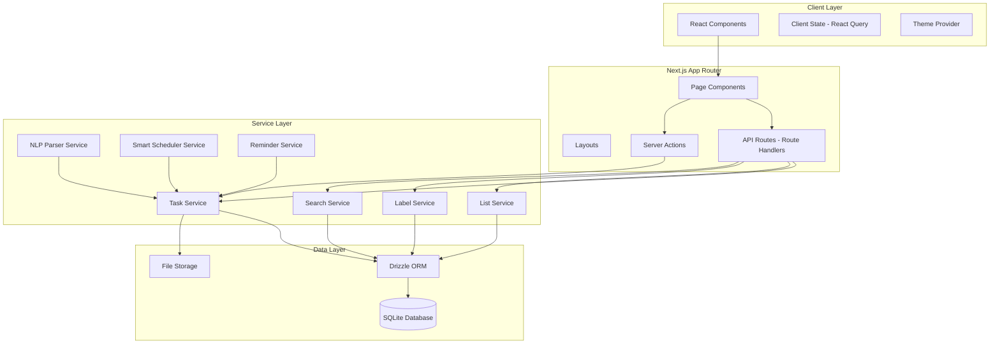
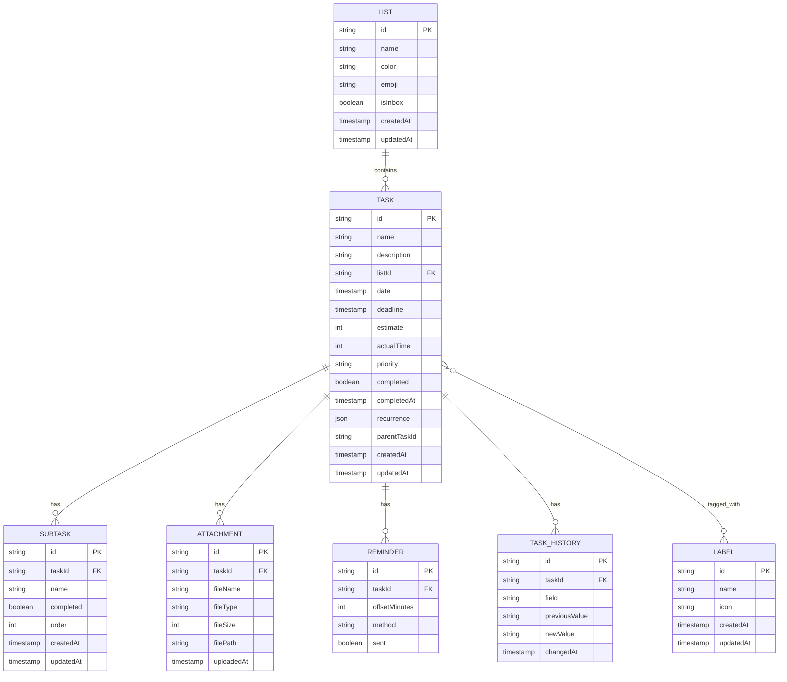

# Design Document: Daily Task Planner

## Overview

The Daily Task Planner is a modern Next.js 16 web application that provides comprehensive task management capabilities. Built with the App Router, TypeScript, Tailwind CSS, and shadcn/ui, it offers a professional dark-mode-first interface with smooth animations via Framer Motion. The application uses SQLite for local data persistence and implements features including lists, labels, multiple views, subtasks, recurring tasks, time tracking, attachments, fuzzy search, natural language input, and smart scheduling.

## Architecture

### High-Level Architecture



### Directory Structure

```
daily-task-planner/
├── src/
│   ├── app/
│   │   ├── layout.tsx              # Root layout with providers
│   │   ├── page.tsx                # Home redirect to /today
│   │   ├── (views)/
│   │   │   ├── today/page.tsx
│   │   │   ├── next-7-days/page.tsx
│   │   │   ├── upcoming/page.tsx
│   │   │   ├── all/page.tsx
│   │   │   └── search/page.tsx
│   │   ├── list/[listId]/page.tsx
│   │   ├── label/[labelId]/page.tsx
│   │   └── api/
│   │       ├── tasks/route.ts
│   │       ├── lists/route.ts
│   │       ├── labels/route.ts
│   │       ├── attachments/route.ts
│   │       └── search/route.ts
│   ├── components/
│   │   ├── ui/                     # shadcn/ui components
│   │   ├── layout/
│   │   │   ├── Sidebar.tsx
│   │   │   ├── MainPanel.tsx
│   │   │   └── Header.tsx
│   │   ├── tasks/
│   │   │   ├── TaskList.tsx
│   │   │   ├── TaskItem.tsx
│   │   │   ├── TaskForm.tsx
│   │   │   ├── TaskDetail.tsx
│   │   │   ├── SubtaskList.tsx
│   │   │   ├── TaskHistory.tsx
│   │   │   └── NaturalLanguageInput.tsx
│   │   ├── lists/
│   │   │   ├── ListItem.tsx
│   │   │   └── ListForm.tsx
│   │   ├── labels/
│   │   │   ├── LabelBadge.tsx
│   │   │   └── LabelForm.tsx
│   │   └── common/
│   │       ├── DatePicker.tsx
│   │       ├── TimePicker.tsx
│   │       ├── EmojiPicker.tsx
│   │       ├── ColorPicker.tsx
│   │       ├── PrioritySelector.tsx
│   │       ├── RecurrenceSelector.tsx
│   │       └── SearchBar.tsx
│   ├── lib/
│   │   ├── db/
│   │   │   ├── schema.ts           # Drizzle schema
│   │   │   ├── index.ts            # DB connection
│   │   │   └── migrations/
│   │   ├── services/
│   │   │   ├── task.service.ts
│   │   │   ├── list.service.ts
│   │   │   ├── label.service.ts
│   │   │   ├── search.service.ts
│   │   │   ├── nlp-parser.service.ts
│   │   │   ├── scheduler.service.ts
│   │   │   └── reminder.service.ts
│   │   ├── utils/
│   │   │   ├── date.ts
│   │   │   ├── recurrence.ts
│   │   │   ├── validation.ts
│   │   │   └── fuzzy-search.ts
│   │   └── hooks/
│   │       ├── useTasks.ts
│   │       ├── useLists.ts
│   │       ├── useLabels.ts
│   │       └── useSearch.ts
│   ├── types/
│   │   └── index.ts
│   └── styles/
│       └── globals.css
├── public/
│   └── uploads/                    # File attachments
├── drizzle.config.ts
├── package.json
├── tailwind.config.ts
└── tsconfig.json
```

## Components and Interfaces

### Core Type Definitions

```typescript
// types/index.ts

export type Priority = 'high' | 'medium' | 'low' | 'none';

export type RecurrenceType = 
  | 'daily' 
  | 'weekly' 
  | 'weekday' 
  | 'monthly' 
  | 'yearly' 
  | 'custom';

export interface RecurrencePattern {
  type: RecurrenceType;
  interval?: number;           // Every N days/weeks/months
  weekdays?: number[];         // 0-6 for Sun-Sat
  monthDay?: number;           // Day of month (1-31)
  ordinal?: number;            // 1st, 2nd, 3rd, etc.
  ordinalWeekday?: number;     // Weekday for ordinal (e.g., 3rd Monday)
}

export type ReminderMethod = 'push' | 'email' | 'in-app';

export interface Reminder {
  id: string;
  taskId: string;
  offsetMinutes: number;       // Minutes before deadline
  method: ReminderMethod;
  sent: boolean;
}

export interface Attachment {
  id: string;
  taskId: string;
  fileName: string;
  fileType: string;
  fileSize: number;
  filePath: string;
  uploadedAt: Date;
}

export interface Label {
  id: string;
  name: string;
  icon?: string;
  createdAt: Date;
  updatedAt: Date;
}

export interface List {
  id: string;
  name: string;
  color?: string;
  emoji?: string;
  isInbox: boolean;
  createdAt: Date;
  updatedAt: Date;
}

export interface Subtask {
  id: string;
  taskId: string;
  name: string;
  completed: boolean;
  order: number;
  createdAt: Date;
  updatedAt: Date;
}

export interface Task {
  id: string;
  name: string;
  description?: string;
  listId: string;
  date?: Date;
  deadline?: Date;
  estimate?: number;           // Minutes
  actualTime?: number;         // Minutes
  priority: Priority;
  completed: boolean;
  completedAt?: Date;
  recurrence?: RecurrencePattern;
  parentTaskId?: string;       // For recurring task instances
  createdAt: Date;
  updatedAt: Date;
  
  // Relations (populated on fetch)
  list?: List;
  labels?: Label[];
  subtasks?: Subtask[];
  attachments?: Attachment[];
  reminders?: Reminder[];
}

export interface TaskHistoryEntry {
  id: string;
  taskId: string;
  field: string;
  previousValue?: string;
  newValue?: string;
  changedAt: Date;
}

export interface ParsedTaskInput {
  name: string;
  date?: Date;
  time?: string;
  priority?: Priority;
  listName?: string;
  labels?: string[];
}

export interface ScheduleSuggestion {
  startTime: Date;
  endTime: Date;
  score: number;               // Suitability score 0-100
  reason: string;
}
```

### Service Interfaces

```typescript
// Task Service
interface ITaskService {
  create(data: CreateTaskInput): Promise<Task>;
  update(id: string, data: UpdateTaskInput): Promise<Task>;
  delete(id: string): Promise<void>;
  getById(id: string): Promise<Task | null>;
  getByListId(listId: string, includeCompleted?: boolean): Promise<Task[]>;
  getByDateRange(start: Date, end: Date, includeCompleted?: boolean): Promise<Task[]>;
  getToday(includeCompleted?: boolean): Promise<Task[]>;
  getOverdue(): Promise<Task[]>;
  getAll(includeCompleted?: boolean): Promise<Task[]>;
  toggleComplete(id: string): Promise<Task>;
  addSubtask(taskId: string, name: string): Promise<Subtask>;
  toggleSubtask(subtaskId: string): Promise<Subtask>;
  deleteSubtask(subtaskId: string): Promise<void>;
  getHistory(taskId: string): Promise<TaskHistoryEntry[]>;
}

// List Service
interface IListService {
  create(data: CreateListInput): Promise<List>;
  update(id: string, data: UpdateListInput): Promise<List>;
  delete(id: string): Promise<void>;
  getAll(): Promise<List[]>;
  getInbox(): Promise<List>;
  ensureInboxExists(): Promise<List>;
}

// Label Service
interface ILabelService {
  create(data: CreateLabelInput): Promise<Label>;
  update(id: string, data: UpdateLabelInput): Promise<Label>;
  delete(id: string): Promise<void>;
  getAll(): Promise<Label[]>;
  addToTask(taskId: string, labelId: string): Promise<void>;
  removeFromTask(taskId: string, labelId: string): Promise<void>;
}

// Search Service
interface ISearchService {
  search(query: string): Promise<Task[]>;
}

// NLP Parser Service
interface INLPParserService {
  parse(input: string): ParsedTaskInput;
}

// Scheduler Service
interface ISchedulerService {
  suggestTimeSlots(task: Task, count?: number): Promise<ScheduleSuggestion[]>;
}

// Reminder Service
interface IReminderService {
  scheduleReminder(taskId: string, reminder: Omit<Reminder, 'id' | 'taskId' | 'sent'>): Promise<Reminder>;
  cancelReminder(reminderId: string): Promise<void>;
  processReminders(): Promise<void>;
}
```

### React Component Props

```typescript
// Task Components
interface TaskListProps {
  tasks: Task[];
  onTaskClick: (task: Task) => void;
  onToggleComplete: (taskId: string) => void;
  showCompleted: boolean;
  groupByDate?: boolean;
}

interface TaskItemProps {
  task: Task;
  onClick: () => void;
  onToggleComplete: () => void;
}

interface TaskFormProps {
  task?: Task;
  listId?: string;
  onSubmit: (data: CreateTaskInput | UpdateTaskInput) => void;
  onCancel: () => void;
}

interface TaskDetailProps {
  task: Task;
  onClose: () => void;
  onUpdate: (data: UpdateTaskInput) => void;
  onDelete: () => void;
}

// Sidebar Components
interface SidebarProps {
  lists: List[];
  labels: Label[];
  overdueCount: number;
  currentPath: string;
  onNavigate: (path: string) => void;
  collapsed?: boolean;
  onToggleCollapse?: () => void;
}
```

## Data Models

### Database Schema (Drizzle ORM)

```typescript
// lib/db/schema.ts
import { sqliteTable, text, integer, real } from 'drizzle-orm/sqlite-core';

export const lists = sqliteTable('lists', {
  id: text('id').primaryKey(),
  name: text('name').notNull(),
  color: text('color'),
  emoji: text('emoji'),
  isInbox: integer('is_inbox', { mode: 'boolean' }).notNull().default(false),
  createdAt: integer('created_at', { mode: 'timestamp' }).notNull(),
  updatedAt: integer('updated_at', { mode: 'timestamp' }).notNull(),
});

export const labels = sqliteTable('labels', {
  id: text('id').primaryKey(),
  name: text('name').notNull(),
  icon: text('icon'),
  createdAt: integer('created_at', { mode: 'timestamp' }).notNull(),
  updatedAt: integer('updated_at', { mode: 'timestamp' }).notNull(),
});

export const tasks = sqliteTable('tasks', {
  id: text('id').primaryKey(),
  name: text('name').notNull(),
  description: text('description'),
  listId: text('list_id').notNull().references(() => lists.id),
  date: integer('date', { mode: 'timestamp' }),
  deadline: integer('deadline', { mode: 'timestamp' }),
  estimate: integer('estimate'),              // Minutes
  actualTime: integer('actual_time'),         // Minutes
  priority: text('priority').notNull().default('none'),
  completed: integer('completed', { mode: 'boolean' }).notNull().default(false),
  completedAt: integer('completed_at', { mode: 'timestamp' }),
  recurrence: text('recurrence', { mode: 'json' }),
  parentTaskId: text('parent_task_id'),
  createdAt: integer('created_at', { mode: 'timestamp' }).notNull(),
  updatedAt: integer('updated_at', { mode: 'timestamp' }).notNull(),
});

export const subtasks = sqliteTable('subtasks', {
  id: text('id').primaryKey(),
  taskId: text('task_id').notNull().references(() => tasks.id, { onDelete: 'cascade' }),
  name: text('name').notNull(),
  completed: integer('completed', { mode: 'boolean' }).notNull().default(false),
  order: integer('order').notNull(),
  createdAt: integer('created_at', { mode: 'timestamp' }).notNull(),
  updatedAt: integer('updated_at', { mode: 'timestamp' }).notNull(),
});

export const taskLabels = sqliteTable('task_labels', {
  taskId: text('task_id').notNull().references(() => tasks.id, { onDelete: 'cascade' }),
  labelId: text('label_id').notNull().references(() => labels.id, { onDelete: 'cascade' }),
});

export const attachments = sqliteTable('attachments', {
  id: text('id').primaryKey(),
  taskId: text('task_id').notNull().references(() => tasks.id, { onDelete: 'cascade' }),
  fileName: text('file_name').notNull(),
  fileType: text('file_type').notNull(),
  fileSize: integer('file_size').notNull(),
  filePath: text('file_path').notNull(),
  uploadedAt: integer('uploaded_at', { mode: 'timestamp' }).notNull(),
});

export const reminders = sqliteTable('reminders', {
  id: text('id').primaryKey(),
  taskId: text('task_id').notNull().references(() => tasks.id, { onDelete: 'cascade' }),
  offsetMinutes: integer('offset_minutes').notNull(),
  method: text('method').notNull(),           // 'push' | 'email' | 'in-app'
  sent: integer('sent', { mode: 'boolean' }).notNull().default(false),
});

export const taskHistory = sqliteTable('task_history', {
  id: text('id').primaryKey(),
  taskId: text('task_id').notNull().references(() => tasks.id, { onDelete: 'cascade' }),
  field: text('field').notNull(),
  previousValue: text('previous_value'),
  newValue: text('new_value'),
  changedAt: integer('changed_at', { mode: 'timestamp' }).notNull(),
});
```

### Entity Relationships




## Correctness Properties

*A property is a characteristic or behavior that should hold true across all valid executions of a system-essentially, a formal statement about what the system should do. Properties serve as the bridge between human-readable specifications and machine-verifiable correctness guarantees.*

Based on the acceptance criteria analysis, the following correctness properties must be verified through property-based testing:

### Property 1: Inbox Immutability
*For any* attempt to delete or rename the Inbox list, the operation SHALL fail and the Inbox list SHALL remain unchanged.
**Validates: Requirements 1.1**

### Property 2: Default List Assignment
*For any* task created without specifying a listId, the task SHALL be assigned to the Inbox list.
**Validates: Requirements 1.2**

### Property 3: Inbox First Ordering
*For any* call to retrieve all lists, the Inbox list SHALL appear first in the returned collection.
**Validates: Requirements 1.3, 18.1**

### Property 4: List Name Validation
*For any* list creation or update operation, if the name is empty or whitespace-only, the operation SHALL fail with a validation error.
**Validates: Requirements 2.1**

### Property 5: List Update Persistence
*For any* list and any valid update (name, color, emoji), updating then retrieving the list SHALL return the updated values.
**Validates: Requirements 2.2**

### Property 6: List Deletion Task Migration
*For any* non-Inbox list containing tasks, deleting the list SHALL result in all those tasks being assigned to the Inbox list.
**Validates: Requirements 2.3**

### Property 7: Task Name Validation and Priority Default
*For any* task creation, if the name is empty the operation SHALL fail; if priority is not specified, it SHALL default to "none".
**Validates: Requirements 3.1, 9.3**

### Property 8: Task Validation Rejection
*For any* task with invalid data (empty name, invalid priority value, invalid time format), creation or update SHALL fail with specific validation errors.
**Validates: Requirements 3.3, 4.4, 24.1**

### Property 9: Task History Logging
*For any* task property modification (including creation and completion), a history entry SHALL be created containing the field name, previous value, new value, and timestamp.
**Validates: Requirements 3.4, 4.1, 5.2, 22.1, 22.2**

### Property 10: Task History Ordering
*For any* task with multiple history entries, retrieving history SHALL return entries ordered from most recent to oldest by timestamp.
**Validates: Requirements 5.3**

### Property 11: Subtask Parent Association
*For any* subtask added to a task, the subtask SHALL be retrievable as a child of that parent task.
**Validates: Requirements 6.1**

### Property 12: Subtask Completion Independence
*For any* task where all subtasks are marked complete, the parent task completed status SHALL remain unchanged (not automatically set to true).
**Validates: Requirements 6.3**

### Property 13: Subtask Cascade Delete
*For any* task with subtasks, deleting the parent task SHALL result in all subtasks being deleted.
**Validates: Requirements 6.4**

### Property 14: Time Format Validation
*For any* estimate or actualTime value, the system SHALL accept valid HH:mm format strings and reject invalid formats.
**Validates: Requirements 7.1, 7.2**

### Property 15: Label Name Validation
*For any* label creation, if the name is empty, the operation SHALL fail with a validation error.
**Validates: Requirements 8.1**

### Property 16: Multiple Label Assignment
*For any* task and any set of labels, all labels SHALL be assignable to the task and retrievable.
**Validates: Requirements 8.2**

### Property 17: Label Cascade Removal
*For any* label that is deleted, that label SHALL be removed from all tasks that had it assigned.
**Validates: Requirements 8.4**

### Property 18: Priority Enum Validation
*For any* priority value, only "high", "medium", "low", or "none" SHALL be accepted; other values SHALL be rejected.
**Validates: Requirements 9.1**

### Property 19: Recurrence Pattern Validation
*For any* recurrence pattern (daily, weekly, weekday, monthly, yearly, custom), the system SHALL accept valid patterns and store them correctly.
**Validates: Requirements 10.1**

### Property 20: Recurring Task Next Occurrence
*For any* recurring task that is completed, the system SHALL create a new task instance with the correct next date based on the recurrence pattern.
**Validates: Requirements 10.2**

### Property 21: Custom Recurrence Calculation
*For any* custom recurrence pattern (interval-based, weekday-specific, ordinal), calculating the next occurrence SHALL produce the correct date.
**Validates: Requirements 10.3**

### Property 22: Recurrence Pattern Formatting
*For any* recurrence pattern, converting to human-readable string SHALL produce a meaningful description that can be parsed back to the same pattern.
**Validates: Requirements 10.4**

### Property 23: Attachment Metadata Persistence
*For any* file attached to a task, the attachment metadata (fileName, fileType, fileSize, filePath) SHALL be stored and retrievable.
**Validates: Requirements 11.1, 11.2**

### Property 24: Attachment Cascade Delete
*For any* attachment removed from a task, both the file reference in the database and the file on disk SHALL be deleted.
**Validates: Requirements 11.3**

### Property 25: Today View Date Filter
*For any* set of tasks with various dates, the Today view SHALL return only tasks where the date equals the current date.
**Validates: Requirements 12.1**

### Property 26: Completed Task Toggle Filter
*For any* view (Today, Next 7 Days, Upcoming, All) with the completed toggle off, completed tasks SHALL be excluded from results.
**Validates: Requirements 12.2, 13.3, 14.3, 15.2**

### Property 27: Next 7 Days View Date Range
*For any* set of tasks, the Next 7 Days view SHALL return only tasks with dates from today through 7 days ahead (inclusive).
**Validates: Requirements 13.1**

### Property 28: Date Grouping
*For any* view that groups by date (Next 7 Days, Upcoming), tasks SHALL be grouped correctly by their date value.
**Validates: Requirements 13.2, 14.2**

### Property 29: Upcoming View Future Filter
*For any* set of tasks, the Upcoming view SHALL return only tasks with dates from today onward.
**Validates: Requirements 14.1**

### Property 30: All View Completeness
*For any* set of tasks (scheduled and unscheduled), the All view SHALL return every task.
**Validates: Requirements 15.1**

### Property 31: Overdue Task Detection
*For any* incomplete task with a deadline in the past, the task SHALL be marked as overdue.
**Validates: Requirements 16.1**

### Property 32: Overdue Count Accuracy
*For any* set of tasks, the overdue count SHALL equal the number of incomplete tasks with past deadlines.
**Validates: Requirements 16.2**

### Property 33: Overdue Completion Clearing
*For any* overdue task that is marked complete, the task SHALL no longer be considered overdue.
**Validates: Requirements 16.3**

### Property 34: Fuzzy Search Matching
*For any* search query and set of tasks, tasks containing approximate matches in name, description, or labels SHALL be returned.
**Validates: Requirements 17.1, 17.3**

### Property 35: Search Result Ranking
*For any* search query with multiple matches, results SHALL be ordered by relevance score (higher scores first).
**Validates: Requirements 17.2**

### Property 36: Data Persistence Round Trip
*For any* task, list, or label created, the entity SHALL be retrievable from the database with all properties intact.
**Validates: Requirements 23.1, 23.2**

### Property 37: Database Error Integrity
*For any* failed database operation, the system SHALL not leave data in an inconsistent state.
**Validates: Requirements 23.3**

### Property 38: Reminder Interval Storage
*For any* reminder with a predefined or custom interval, the offsetMinutes and method SHALL be stored correctly.
**Validates: Requirements 27.1, 27.2**

### Property 39: Multiple Reminder Support
*For any* task with multiple reminders, all reminders SHALL be stored and retrievable independently.
**Validates: Requirements 27.4**

### Property 40: Natural Language Date Extraction
*For any* natural language input containing date/time references (e.g., "tomorrow", "next Monday", "at 3 PM"), the parser SHALL extract the correct date and time.
**Validates: Requirements 28.1**

### Property 41: Natural Language Priority Extraction
*For any* natural language input containing priority indicators ("urgent", "high priority", "important"), the parser SHALL set the appropriate priority level.
**Validates: Requirements 28.2**

### Property 42: Natural Language List Extraction
*For any* natural language input containing list references ("in Work", "#Personal"), the parser SHALL identify the target list.
**Validates: Requirements 28.3**

### Property 43: Natural Language Fallback
*For any* natural language input that cannot be parsed into structured data, the entire input SHALL be used as the task name.
**Validates: Requirements 28.5**

### Property 44: Schedule Suggestion Non-Conflict
*For any* scheduling suggestion, the suggested time slot SHALL not overlap with existing scheduled tasks.
**Validates: Requirements 29.3**

### Property 45: Schedule Suggestion Ranking
*For any* set of scheduling suggestions, suggestions SHALL be ordered by suitability score (higher scores first).
**Validates: Requirements 29.5**

## Error Handling

### Error Categories

1. **Validation Errors**: Invalid input data (empty names, invalid formats, out-of-range values)
2. **Not Found Errors**: Requested entity does not exist
3. **Conflict Errors**: Operation would violate constraints (e.g., deleting Inbox)
4. **Database Errors**: SQLite operation failures
5. **File System Errors**: Attachment upload/download failures
6. **External Service Errors**: Email/push notification failures

### Error Response Format

```typescript
interface ErrorResponse {
  error: {
    code: string;
    message: string;
    details?: Record<string, string[]>;  // Field-specific errors
  };
}

// Example validation error
{
  error: {
    code: 'VALIDATION_ERROR',
    message: 'Invalid task data',
    details: {
      name: ['Name is required'],
      estimate: ['Invalid time format. Use HH:mm']
    }
  }
}
```

### Error Handling Strategy

- All service methods return `Result<T, Error>` pattern or throw typed errors
- API routes catch errors and return appropriate HTTP status codes
- Client-side error boundaries catch rendering errors
- Toast notifications display user-friendly error messages
- Failed operations are logged for debugging

## Testing Strategy

### Dual Testing Approach

The application uses both unit testing and property-based testing for comprehensive coverage:

- **Unit tests** verify specific examples, edge cases, and integration points
- **Property-based tests** verify universal properties that should hold across all inputs
- Together they provide comprehensive coverage: unit tests catch concrete bugs, property tests verify general correctness

### Testing Framework

- **Bun Test**: Primary test runner for unit tests
- **fast-check**: Property-based testing library for TypeScript
- Each property-based test runs a minimum of 100 iterations

### Test Organization

```
src/
├── lib/
│   ├── services/
│   │   ├── task.service.ts
│   │   ├── task.service.test.ts        # Unit tests
│   │   └── task.service.property.test.ts  # Property tests
│   ├── utils/
│   │   ├── recurrence.ts
│   │   ├── recurrence.test.ts
│   │   └── recurrence.property.test.ts
│   │   ├── nlp-parser.ts
│   │   └── nlp-parser.property.test.ts
```

### Property Test Annotation Format

Each property-based test must be annotated with:
```typescript
/**
 * **Feature: daily-task-planner, Property 20: Recurring Task Next Occurrence**
 * **Validates: Requirements 10.2**
 */
```

### Test Categories

1. **Service Layer Tests**
   - Task CRUD operations
   - List management
   - Label operations
   - Search functionality

2. **Utility Function Tests**
   - Date calculations
   - Recurrence pattern parsing and next date calculation
   - Time format validation
   - Fuzzy search algorithm
   - Natural language parsing

3. **Integration Tests**
   - API route handlers
   - Database operations
   - File upload/download

### Key Test Scenarios

- Inbox list immutability
- Task cascade operations (subtasks, attachments, labels)
- View filtering accuracy
- Recurrence pattern calculations
- Natural language parsing edge cases
- Search relevance ranking
- Concurrent operation handling
